# Remote GWOSC verification agent runbook

_Controlled execution, evidence-only local commit, and manual push for the Paper 1 GWOSC gate_

---

## 📋 Agent mandate

Execute the current `main` branch exactly as committed, archive all lightweight evidence in the local repository checkout, and create one evidence-only local commit. Do not fetch, pull, change remotes, authenticate with GitHub, or push after the run. The user will inspect and push the evidence commit manually.

A failed command or failed scientific acceptance is still a valid result. Preserve it, package the available evidence, and stop. Do not tune the pipeline or repeat the run with altered settings to obtain a pass.

```mermaid
flowchart LR
    accTitle: Remote GWOSC Evidence Loop
    accDescr: Controlled flow from a clean main checkout through Stage 0, GWOSC execution, evidence packaging, and local verification

    clean_main([🔍 Verify clean main]) --> stage_zero[🧪 Run Stage 0]
    stage_zero --> stage_passed{Stage 0 accepted?}
    stage_passed -->|No| package_failure[📦 Package failure evidence]
    stage_passed -->|Yes| run_gwosc[⚙️ Run GWOSC checks]
    run_gwosc --> package_result[📦 Package all evidence]
    package_failure --> scope_check{Only evidence changed?}
    package_result --> scope_check
    scope_check -->|No| stop[❌ Stop and report]
    scope_check -->|Yes| local_commit[📦 Commit evidence locally]
    local_commit --> manual_review([🔍 User reviews and pushes])

    classDef action fill:#dbeafe,stroke:#2563eb,stroke-width:2px,color:#1e3a5f
    classDef decision fill:#fef9c3,stroke:#ca8a04,stroke-width:2px,color:#713f12
    classDef success fill:#dcfce7,stroke:#16a34a,stroke-width:2px,color:#14532d
    classDef danger fill:#fee2e2,stroke:#dc2626,stroke-width:2px,color:#7f1d1d

    class clean_main,stage_zero,run_gwosc,package_failure,package_result,local_commit action
    class stage_passed,scope_check decision
    class manual_review success
    class stop danger
```



## 🛡️ Non-negotiable controls

1. Work on `main`; do not create a development branch.
2. Start from a clean checkout and use `git pull --ff-only origin main`.
3. Do not use `git reset`, `git clean`, force-push, or delete existing results.
4. Do not edit files under `src/`, `scripts/`, `configs/`, `tests/`, or `docs/`.
5. Keep raw GWOSC arrays outside the repository under `/ceph/dwong/paper1_dataset`.
6. Do not use `--force` when downloading. Existing cached data should be reused and checksummed.
7. Run Stage 0 before creating `evidence/gwosc/<run-id>/`. Stage 0 requires a clean Git tree.
8. Preserve both passes and failures. Do not alter thresholds or rerun with different seeds.
9. After Step 1 records the clean starting checkout, do not fetch, pull, change remotes, authenticate, or push.
10. Stage and commit only `evidence/gwosc/<run-id>/`, then stop for manual inspection and push.

## 📋 Prerequisites

The remote machine needs:

| Requirement | Expected value | Verification |
| --- | --- | --- |
| Repository | `dowlingwong/noise-weighted-subspace-reconstruction` | `git remote get-url origin` |
| Branch | `main` | `git branch --show-current` |
| Python bootstrap | Python 3 | `python3 --version` |
| Environment manager | `uv` | `uv --version` |
| Persistent session | `tmux` recommended | `tmux -V` |
| Dataset root | `/ceph/dwong/paper1_dataset` | `test -d /ceph/dwong/paper1_dataset` |

Use a persistent shell:

```bash
tmux new -s paper1-gwosc
```

If the repository is not present:

```bash
cd "$HOME"
git clone https://github.com/dowlingwong/noise-weighted-subspace-reconstruction.git
cd noise-weighted-subspace-reconstruction
```

If it is already present, enter that checkout without deleting or replacing it.

## 🔧 Operation

### Step 1: synchronize and prove the checkout is clean

Run:

```bash
cd /path/to/noise-weighted-subspace-reconstruction

git switch main
git pull --ff-only origin main

test "$(git branch --show-current)" = "main"
test -z "$(git status --porcelain=v1 --untracked-files=all)"

git remote get-url origin
git log -1 --oneline
```

Expected result:

- The current branch is `main`
- `git pull` is fast-forward only
- `git status --porcelain` prints nothing
- The remote URL is the repository above

If the tree is dirty, stop. Report `git status --short` without stashing, deleting, or overwriting anything.

### Step 2: define immutable run identifiers outside the repository

Run these commands in the same shell that will execute the verification:

```bash
export PAPER1_DATA_ROOT=/ceph/dwong/paper1_dataset

REPO_ROOT="$PWD"
BASE_COMMIT="$(git rev-parse HEAD)"
RUN_ID="$(date -u +%Y%m%dT%H%M%SZ)_${BASE_COMMIT:0:12}"
TMP_RUN_DIR="${TMPDIR:-/tmp}/paper1_gwosc_${RUN_ID}"
STAGE0_DIR="$REPO_ROOT/results/stage0/$RUN_ID"
STAGE0_RC="not_run"
DOWNLOAD_RC="not_run"
RAW_VALIDATION_RC="not_run"
REFERENCE_RC="not_run"
EXPERIMENT_RC="not_run"
FILTER_EQUIVALENCE_RC="not_run"
TIME_LOCAL_RC="not_run"

mkdir -p "$TMP_RUN_DIR"

printf 'RUN_ID=%s\nBASE_COMMIT=%s\nREPO_ROOT=%s\nPAPER1_DATA_ROOT=%s\n' \
  "$RUN_ID" "$BASE_COMMIT" "$REPO_ROOT" "$PAPER1_DATA_ROOT" \
  | tee "$TMP_RUN_DIR/00_run_identity.txt"
```

Do not create the tracked evidence directory yet.

Capture preflight information:

```bash
{
  date -u
  hostname
  pwd
  git remote -v
  git status --short --branch
  python3 --version
  uv --version
  df -h "$REPO_ROOT" "$PAPER1_DATA_ROOT"
} 2>&1 | tee "$TMP_RUN_DIR/01_preflight.txt"
```

### Step 3: run the clean-checkout Stage 0 gate

Run all five Stage 0 commands and retain the combined console output:

```bash
set -o pipefail
set +e
python3 scripts/stage0_remote_gate.py \
  --output-dir "$STAGE0_DIR" \
  --continue-on-failure \
  2>&1 | tee "$TMP_RUN_DIR/02_stage0_console.txt"
STAGE0_RC=${PIPESTATUS[0]}

printf '%s\n' "$STAGE0_RC" > "$TMP_RUN_DIR/02_stage0_exit_code.txt"
```

Verify the machine-readable result:

```bash
python3 - "$STAGE0_DIR/summary.json" "$BASE_COMMIT" \
  2>&1 <<'PY' | tee "$TMP_RUN_DIR/03_stage0_verification.txt"
import json
import sys
from pathlib import Path

summary_path = Path(sys.argv[1])
expected_commit = sys.argv[2]
summary = json.loads(summary_path.read_text())

print(json.dumps({
    "accepted": summary["accepted"],
    "commit": summary["git"]["commit"],
    "branch": summary["git"]["branch"],
    "requirements": summary["requirements"],
}, indent=2, sort_keys=True))

if summary["git"]["commit"] != expected_commit:
    raise SystemExit("Stage 0 commit does not match BASE_COMMIT")
if not summary["accepted"]:
    raise SystemExit("Stage 0 was not accepted")
PY
STAGE0_VERIFY_RC=${PIPESTATUS[0]}
```

If either `STAGE0_RC` or `STAGE0_VERIFY_RC` is nonzero, skip Steps 4–7. Continue at Step 8, package all available Stage 0 evidence locally, report it, and stop.

### Step 4: download or validate the cached GWOSC data

Run the configured downloader without `--force`:

```bash
set +e
uv run python scripts/download/download_gwosc.py \
  --download \
  --timeout 900 \
  2>&1 | tee "$TMP_RUN_DIR/04_download_gwosc.txt"
DOWNLOAD_RC=${PIPESTATUS[0]}

printf '%s\n' "$DOWNLOAD_RC" > "$TMP_RUN_DIR/04_download_exit_code.txt"
if test "$DOWNLOAD_RC" -ne 0; then
  echo "Download failed; skip to Step 8 after capturing available metadata."
fi
```

This command should reuse valid cached `.npz` files when present. It must write or refresh:

```text
/ceph/dwong/paper1_dataset/gwosc/raw/GW150914/metadata.json
```

Validate the metadata and every cached file checksum:

```bash
RAW_METADATA="$PAPER1_DATA_ROOT/gwosc/raw/GW150914/metadata.json"

uv run python - "$RAW_METADATA" \
  2>&1 <<'PY' | tee "$TMP_RUN_DIR/05_raw_data_validation.txt"
import hashlib
import json
import sys
from pathlib import Path

metadata_path = Path(sys.argv[1])
metadata = json.loads(metadata_path.read_text())

assert metadata["event"] == "GW150914"
assert metadata["duration_seconds"] == 256
assert metadata["requested_sample_rate_hz"] == 4096
assert set(metadata["detectors"]) == {"H1", "L1"}

for detector in metadata["detectors"]:
    quality = metadata["data_quality"][detector]
    assert quality["flag"] == f"{detector}_DATA"
    assert quality["segments"], f"Missing official DATA segments for {detector}"

for item in metadata["files"]:
    path = Path(item["path"])
    if not path.is_file():
        raise SystemExit(f"Missing cached file: {path}")
    digest = hashlib.sha256()
    with path.open("rb") as handle:
        for block in iter(lambda: handle.read(1024 * 1024), b""):
            digest.update(block)
    actual = digest.hexdigest()
    print(f"{actual}  {path}")
    if actual != item["sha256"]:
        raise SystemExit(f"Checksum mismatch: {path}")

for item in metadata.get("waveforms", []):
    path = Path(item["path"])
    if not path.is_file():
        raise SystemExit(f"Missing documented waveform: {path}")
    digest = hashlib.sha256(path.read_bytes()).hexdigest()
    print(f"{digest}  {path}")
    if digest != item["sha256"]:
        raise SystemExit(f"Waveform checksum mismatch: {path}")
PY
RAW_VALIDATION_RC=${PIPESTATUS[0]}
```

If `DOWNLOAD_RC` or `RAW_VALIDATION_RC` is nonzero, skip Steps 5–7 and package the failure at Step 8.

### Step 5: run the independent GWpy reference path

Use a unique output path so previous evidence is not overwritten:

```bash
REFERENCE_OUTPUT="$PAPER1_DATA_ROOT/gwosc/processed/GW150914_gwpy_reference_${RUN_ID}.json"

set +e
uv run python scripts/preprocess/preprocess_gwosc.py \
  --reference-check \
  --output "$REFERENCE_OUTPUT" \
  2>&1 | tee "$TMP_RUN_DIR/06_gwpy_reference_check.txt"
REFERENCE_RC=${PIPESTATUS[0]}

printf '%s\n' "$REFERENCE_RC" > "$TMP_RUN_DIR/06_reference_exit_code.txt"
if test "$REFERENCE_RC" -ne 0 || test ! -s "$REFERENCE_OUTPUT"; then
  echo "GWpy reference check failed; skip to Step 8."
fi
```

Do not interpret a zero process exit code as scientific acceptance. The final experiment JSON is authoritative.

### Step 6: run the config-pinned GWOSC experiments

Use a unique ignored working output:

```bash
EXPERIMENT_OUTPUT="$REPO_ROOT/results/metrics/p1_gwosc_gw150914_${RUN_ID}.json"

set +e
uv run python scripts/run_experiment.py \
  --config configs/gwosc/gw150914_smoke.yaml \
  --output "$EXPERIMENT_OUTPUT" \
  2>&1 | tee "$TMP_RUN_DIR/07_gwosc_experiment.txt"
EXPERIMENT_RC=${PIPESTATUS[0]}

printf '%s\n' "$EXPERIMENT_RC" > "$TMP_RUN_DIR/07_experiment_exit_code.txt"
if test "$EXPERIMENT_RC" -ne 0 || test ! -s "$EXPERIMENT_OUTPUT"; then
  echo "GWOSC experiment failed operationally; skip to Step 8."
fi
```

Run the predeclared filtering/statistic-equivalence sweep:

```bash
FILTER_EQUIVALENCE_OUTPUT="$REPO_ROOT/results/metrics/p1_gwosc_filter_equivalence_${RUN_ID}.json"

set +e
uv run python scripts/run_experiment.py \
  --config configs/gwosc/filter_statistic_equivalence.yaml \
  --output "$FILTER_EQUIVALENCE_OUTPUT" \
  2>&1 | tee "$TMP_RUN_DIR/08_filter_statistic_equivalence.txt"
FILTER_EQUIVALENCE_RC=${PIPESTATUS[0]}

printf '%s\n' "$FILTER_EQUIVALENCE_RC" \
  > "$TMP_RUN_DIR/08_filter_equivalence_exit_code.txt"
if test "$FILTER_EQUIVALENCE_RC" -ne 0 \
  || test ! -s "$FILTER_EQUIVALENCE_OUTPUT"; then
  echo "Filtering/statistic-equivalence experiment failed operationally."
fi
```

Run the predeclared global-versus-local PSD experiment:

```bash
TIME_LOCAL_OUTPUT="$REPO_ROOT/results/metrics/p1_gwosc_time_local_noise_${RUN_ID}.json"

set +e
uv run python scripts/run_experiment.py \
  --config configs/gwosc/time_local_noise.yaml \
  --output "$TIME_LOCAL_OUTPUT" \
  2>&1 | tee "$TMP_RUN_DIR/09_time_local_noise.txt"
TIME_LOCAL_RC=${PIPESTATUS[0]}

printf '%s\n' "$TIME_LOCAL_RC" \
  > "$TMP_RUN_DIR/09_time_local_exit_code.txt"
if test "$TIME_LOCAL_RC" -ne 0 || test ! -s "$TIME_LOCAL_OUTPUT"; then
  echo "Time-local-noise experiment failed operationally."
fi
```

The run must use the committed settings:

- Hann-windowed periodograms
- Bias-corrected median PSD aggregation
- GWpy median-Welch reference comparison
- Calibration-window quality diagnostics
- Five held-out split seeds
- Per-split ratio bounds `[0.5, 1.5]`
- Median ratio bounds `[0.8, 1.2]`
- Public documented GW150914 numerical-simulation waveform
- FIR durations `[0.25, 0.5, 1.0, 2.0]` seconds
- Edge trims `[0.125, 0.25, 0.5, 1.0]` seconds
- Local PSD radii `[32, 64, 96]` seconds, with 64 seconds primary
- Minimum primary local-model coverage `0.9`
- Fixed narrow bands `[20,80]`, `[80,150]`, `[150,300]`, `[300,512]` Hz

Do not change these values on the server.

### Step 7: extract a compact acceptance summary

Create a lightweight summary without discarding the full result:

```bash
uv run python - "$EXPERIMENT_OUTPUT" "$BASE_COMMIT" "$TMP_RUN_DIR/acceptance_summary.json" <<'PY'
import json
import sys
from pathlib import Path

result_path = Path(sys.argv[1])
expected_commit = sys.argv[2]
output_path = Path(sys.argv[3])
record = json.loads(result_path.read_text())

detectors = {}
for detector, metrics in record["metrics"]["detectors"].items():
    null_gate = metrics["null_calibration_validation"]
    quality = metrics["psd_calibration_quality"]
    reference = metrics.get("gwpy_reference")
    detectors[detector] = {
        "accepted": null_gate["passed"],
        "split_results": null_gate["splits"],
        "median_null_sigma_over_predicted": (
            null_gate["median_null_sigma_over_predicted"]
        ),
        "minimum_null_sigma_over_predicted": (
            null_gate["min_null_sigma_over_predicted"]
        ),
        "maximum_null_sigma_over_predicted": (
            null_gate["max_null_sigma_over_predicted"]
        ),
        "psd_calibration_quality": quality,
        "evaluation_window_quality": metrics["evaluation_window_quality"],
        "blocked_null_calibration_validation": (
            metrics["blocked_null_calibration_validation"]
        ),
        "data_quality": metrics["data_quality"],
        "gwpy_reference": reference,
    }

summary = {
    "experiment_id": record["experiment_id"],
    "status": record["status"],
    "git_commit": record["git_commit"],
    "acceptance": record["metrics"]["acceptance"],
    "detectors": detectors,
}
output_path.write_text(json.dumps(summary, indent=2, sort_keys=True) + "\n")
print(output_path)

if record["git_commit"] != expected_commit:
    raise SystemExit("Experiment commit does not match BASE_COMMIT")
PY

cat "$TMP_RUN_DIR/acceptance_summary.json"
```

`status: failed_acceptance` is not an operational failure. Preserve it exactly as produced for manual review.

Create compact summaries for the two diagnostic experiments:

```bash
if test -s "$FILTER_EQUIVALENCE_OUTPUT" \
  && test -s "$TIME_LOCAL_OUTPUT"; then
  uv run python - \
    "$FILTER_EQUIVALENCE_OUTPUT" \
    "$TIME_LOCAL_OUTPUT" \
    "$TMP_RUN_DIR/diagnostic_summary.json" <<'PY'
import json
import sys
from pathlib import Path

filter_record = json.loads(Path(sys.argv[1]).read_text())
local_record = json.loads(Path(sys.argv[2]).read_text())
output = Path(sys.argv[3])

filter_metrics = filter_record["metrics"]
local_metrics = local_record["metrics"]

def compact_filter_sweep(sweep):
    return [
        {
            "fduration_seconds": item["fduration_seconds"],
            "edge_trim_seconds": item["edge_trim_seconds"],
            "is_predeclared_primary": item["is_predeclared_primary"],
            "identity": item["identity"],
            "original_gls_vs_shared_fir": (
                item["original_gls_vs_shared_fir"]
            ),
        }
        for item in sweep
    ]

def compact_local_summaries(summaries):
    compact = {}
    for name, item in summaries.items():
        score_summary = {
            key: value
            for key, value in item["scores"].items()
            if key != "values"
        }
        compact[name] = {
            **item,
            "scores": score_summary,
        }
    return compact

summary = {
    "filter_statistic_equivalence": {
        "status": filter_record["status"],
        "acceptance": filter_metrics["acceptance"],
        "synthetic_sweep": compact_filter_sweep(
            filter_metrics["synthetic_control"]["sweep"]
        ),
        "real_data": {
            detector: compact_filter_sweep(metrics["sweep"])
            for detector, metrics in filter_metrics["real_data"].items()
        },
    },
    "time_local_noise": {
        "status": local_record["status"],
        "acceptance": local_metrics["acceptance"],
        "synthetic_summaries": compact_local_summaries(
            local_metrics["synthetic_control"]["summaries"]
        ),
        "real_summaries": {
            detector: compact_local_summaries(metrics["summaries"])
            for detector, metrics in local_metrics["real_data"].items()
        },
    },
}
output.write_text(json.dumps(summary, indent=2, sort_keys=True) + "\n")
print(output)
PY
else
  echo "Diagnostic summary skipped because one experiment record is absent."
fi
```

### Step 8: package lightweight evidence inside the repository

Only now create the tracked evidence directory:

```bash
EVIDENCE_REL="evidence/gwosc/$RUN_ID"
EVIDENCE_DIR="$REPO_ROOT/$EVIDENCE_REL"

mkdir -p \
  "$EVIDENCE_DIR/console" \
  "$EVIDENCE_DIR/stage0" \
  "$EVIDENCE_DIR/gwosc"

cp "$TMP_RUN_DIR"/*.txt "$EVIDENCE_DIR/console/" 2>/dev/null || true

cp "$STAGE0_DIR/summary.json" "$EVIDENCE_DIR/stage0/" 2>/dev/null || true
cp "$STAGE0_DIR/environment_before.json" "$EVIDENCE_DIR/stage0/" 2>/dev/null || true
cp "$STAGE0_DIR/dependencies.txt" "$EVIDENCE_DIR/stage0/" 2>/dev/null || true

for source in "$STAGE0_DIR"/*.log; do
  test -e "$source" || continue
  target="$EVIDENCE_DIR/stage0/$(basename "${source%.log}").txt"
  cp "$source" "$target"
done

if test -n "${RAW_METADATA:-}" && test -f "$RAW_METADATA"; then
  cp "$RAW_METADATA" "$EVIDENCE_DIR/gwosc/raw_metadata.json"
fi

if test -n "${REFERENCE_OUTPUT:-}" && test -f "$REFERENCE_OUTPUT"; then
  cp "$REFERENCE_OUTPUT" "$EVIDENCE_DIR/gwosc/gwpy_reference.json"
fi

if test -n "${EXPERIMENT_OUTPUT:-}" && test -f "$EXPERIMENT_OUTPUT"; then
  cp "$EXPERIMENT_OUTPUT" "$EVIDENCE_DIR/gwosc/experiment.json"
fi

if test -n "${EXPERIMENT_OUTPUT:-}" \
  && test -f "${EXPERIMENT_OUTPUT%.json}.config.yaml"; then
  cp "${EXPERIMENT_OUTPUT%.json}.config.yaml" \
    "$EVIDENCE_DIR/gwosc/experiment.config.yaml"
fi

if test -n "${EXPERIMENT_OUTPUT:-}" \
  && test -f "${EXPERIMENT_OUTPUT%.json}.log"; then
  cp "${EXPERIMENT_OUTPUT%.json}.log" \
    "$EVIDENCE_DIR/gwosc/experiment.txt"
fi

if test -f "$TMP_RUN_DIR/acceptance_summary.json"; then
  cp "$TMP_RUN_DIR/acceptance_summary.json" \
    "$EVIDENCE_DIR/gwosc/acceptance_summary.json"
fi

if test -f "$TMP_RUN_DIR/diagnostic_summary.json"; then
  cp "$TMP_RUN_DIR/diagnostic_summary.json" \
    "$EVIDENCE_DIR/gwosc/diagnostic_summary.json"
fi

if test -n "${FILTER_EQUIVALENCE_OUTPUT:-}" \
  && test -f "$FILTER_EQUIVALENCE_OUTPUT"; then
  cp "$FILTER_EQUIVALENCE_OUTPUT" \
    "$EVIDENCE_DIR/gwosc/filter_equivalence.json"
fi
if test -n "${FILTER_EQUIVALENCE_OUTPUT:-}" \
  && test -f "${FILTER_EQUIVALENCE_OUTPUT%.json}.config.yaml"; then
  cp "${FILTER_EQUIVALENCE_OUTPUT%.json}.config.yaml" \
    "$EVIDENCE_DIR/gwosc/filter_equivalence.config.yaml"
fi
if test -n "${FILTER_EQUIVALENCE_OUTPUT:-}" \
  && test -f "${FILTER_EQUIVALENCE_OUTPUT%.json}.log"; then
  cp "${FILTER_EQUIVALENCE_OUTPUT%.json}.log" \
    "$EVIDENCE_DIR/gwosc/filter_equivalence.txt"
fi

if test -n "${TIME_LOCAL_OUTPUT:-}" \
  && test -f "$TIME_LOCAL_OUTPUT"; then
  cp "$TIME_LOCAL_OUTPUT" "$EVIDENCE_DIR/gwosc/time_local_noise.json"
fi
if test -n "${TIME_LOCAL_OUTPUT:-}" \
  && test -f "${TIME_LOCAL_OUTPUT%.json}.config.yaml"; then
  cp "${TIME_LOCAL_OUTPUT%.json}.config.yaml" \
    "$EVIDENCE_DIR/gwosc/time_local_noise.config.yaml"
fi
if test -n "${TIME_LOCAL_OUTPUT:-}" \
  && test -f "${TIME_LOCAL_OUTPUT%.json}.log"; then
  cp "${TIME_LOCAL_OUTPUT%.json}.log" \
    "$EVIDENCE_DIR/gwosc/time_local_noise.txt"
fi
```

Create the run manifest:

```bash
python3 - \
  "$EVIDENCE_DIR/manifest.json" \
  "$RUN_ID" \
  "$BASE_COMMIT" \
  "${STAGE0_RC:-not_run}" \
  "${DOWNLOAD_RC:-not_run}" \
  "${RAW_VALIDATION_RC:-not_run}" \
  "${REFERENCE_RC:-not_run}" \
  "${EXPERIMENT_RC:-not_run}" \
  "${FILTER_EQUIVALENCE_RC:-not_run}" \
  "${TIME_LOCAL_RC:-not_run}" <<'PY'
import json
import socket
import sys
from datetime import datetime, timezone
from pathlib import Path

output = Path(sys.argv[1])
manifest = {
    "run_id": sys.argv[2],
    "base_commit": sys.argv[3],
    "captured_at_utc": datetime.now(timezone.utc).isoformat(),
    "hostname": socket.gethostname(),
    "command_exit_codes": {
        "stage0": sys.argv[4],
        "download": sys.argv[5],
        "raw_validation": sys.argv[6],
        "gwpy_reference": sys.argv[7],
        "gwosc_experiment": sys.argv[8],
        "filter_statistic_equivalence": sys.argv[9],
        "time_local_noise": sys.argv[10],
    },
    "raw_data_in_repository": False,
    "raw_data_root": "/ceph/dwong/paper1_dataset",
}
output.write_text(json.dumps(manifest, indent=2, sort_keys=True) + "\n")
PY
```

Generate evidence checksums:

```bash
(
  cd "$EVIDENCE_DIR"
  find . -type f ! -name SHA256SUMS -print0 \
    | sort -z \
    | xargs -0 sha256sum > SHA256SUMS
)
```

### Step 9: enforce evidence safety before Git staging

Reject any accidental raw arrays or large-data formats:

```bash
if find "$EVIDENCE_DIR" -type f \
  \( -name '*.npz' -o -name '*.npy' -o -name '*.h5' -o -name '*.hdf5' \
     -o -name '*.root' -o -name '*.zst' \) \
  | grep -q .; then
  echo "Raw or large data found in evidence directory; stop."
  exit 1
fi

du -sh "$EVIDENCE_DIR"
find "$EVIDENCE_DIR" -maxdepth 3 -type f -print | sort
```

Verify that the only Git changes are under this run's evidence directory:

```bash
python3 - "$EVIDENCE_REL/" <<'PY'
import subprocess
import sys

allowed_prefix = sys.argv[1]
status = subprocess.run(
    ["git", "status", "--porcelain=v1", "--untracked-files=all"],
    check=True,
    capture_output=True,
    text=True,
).stdout.splitlines()

unexpected = []
for line in status:
    path = line[3:]
    if " -> " in path:
        path = path.split(" -> ", 1)[1]
    if not path.startswith(allowed_prefix):
        unexpected.append(line)

print("\n".join(status))
if unexpected:
    raise SystemExit(
        "Unexpected changes outside evidence directory:\n" + "\n".join(unexpected)
    )
PY
```

If this check fails, do not stage, commit, or synchronize anything. Report the unexpected paths.

### Step 10: verify and create the evidence-only local commit

Verify the evidence bundle:

```bash
(
  cd "$EVIDENCE_DIR"
  sha256sum --check SHA256SUMS
)

find "$EVIDENCE_DIR" -maxdepth 3 -type f -print | sort
git status --short --branch

printf 'RUN_ID=%s\nBASE_COMMIT=%s\nEVIDENCE_DIR=%s\n' \
  "$RUN_ID" "$BASE_COMMIT" "$EVIDENCE_DIR"
```

Stage only the current evidence directory and verify its scope:

```bash
git add -- "$EVIDENCE_REL"
git diff --cached --check

STAGED_PATHS="$(git diff --cached --name-only)"
printf '%s\n' "$STAGED_PATHS"

python3 - "$EVIDENCE_REL/" <<'PY'
import subprocess
import sys

allowed_prefix = sys.argv[1]
paths = subprocess.run(
    ["git", "diff", "--cached", "--name-only"],
    check=True,
    capture_output=True,
    text=True,
).stdout.splitlines()

if not paths:
    raise SystemExit("No evidence files were staged")

unexpected = [path for path in paths if not path.startswith(allowed_prefix)]
if unexpected:
    raise SystemExit(
        "Staged paths outside the evidence directory:\n"
        + "\n".join(unexpected)
    )
PY
```

Create one local commit:

```bash
git commit -m "Archive GWOSC remote verification $RUN_ID"
EVIDENCE_COMMIT="$(git rev-parse HEAD)"

git status --short --branch

printf 'RUN_ID=%s\nBASE_COMMIT=%s\nEVIDENCE_COMMIT=%s\n' \
  "$RUN_ID" "$BASE_COMMIT" "$EVIDENCE_COMMIT"
```

The agent must stop after the local commit. It must not run:

- `git fetch` or `git pull`
- `git remote set-url`
- `gh auth` or any credential setup
- `git push`

Leave the local branch ahead of `origin/main` by the single evidence commit so the user can inspect and push it manually.

## ✅ Required final report

Return exactly these items to the user:

1. `RUN_ID`
2. `BASE_COMMIT`
3. Evidence commit SHA
4. Stage 0 accepted: `true` or `false`
5. GWOSC run status: `complete`, `failed_acceptance`, `not_run`, or `operational_failure`
6. H1 and L1 median `null_sigma_over_predicted`, if produced
7. Failed split seeds and ratios, if produced
8. Absolute evidence directory path
9. Evidence checksum verification result
10. Complete `git status --short --branch` output
11. Any command that failed, with its exit code
12. Confirmation that only the evidence directory was committed and no fetch, pull, authentication, remote change, or push occurred after execution began
13. Filtering/statistic-equivalence status and the worst synthetic and real
    maximum absolute score differences
14. At the predeclared 1.0-second FIR and 0.5-second trim, H1/L1
    GLS-to-shared-FIR score correlations and standard-deviation ratios
15. Time-local-noise status; global and primary-local score standard
    deviations, primary coverage fractions, and five chronological block
    standard deviations for synthetic, H1, and L1

Do not summarize away a failure. The local JSON and logs are the source of truth.

## 🔧 Failure handling

| Failure | Required action |
| --- | --- |
| Dirty checkout before Stage 0 | Stop; report `git status --short` |
| Stage 0 rejected | Package Stage 0 evidence; do not run GWOSC |
| Download/network failure | Package logs and metadata if available; do not use `--force` |
| Raw checksum mismatch | Package metadata and checksum log; do not preprocess |
| GWpy reference command fails | Package all available evidence; do not tune dependencies ad hoc |
| Experiment returns `failed_acceptance` | Package and commit locally; this is a scientific result |
| Unexpected Git changes | Do not stage or synchronize; report paths |
| Git authentication unavailable | Irrelevant to the run; do not configure credentials or attempt a push |

## 🔄 Manual verification and synchronization

The agent must not execute this section. These commands are for the user after reviewing the agent's final report and local commit.

On the execution machine, inspect the local evidence:

```bash
RUN_ID="<run-id-from-remote-agent>"
find "evidence/gwosc/$RUN_ID" -maxdepth 3 -type f -print | sort

(
  cd "evidence/gwosc/$RUN_ID"
  sha256sum --check SHA256SUMS
)
```

Inspect, in this order:

1. `stage0/summary.json`
2. `manifest.json`
3. `gwosc/acceptance_summary.json`
4. `gwosc/diagnostic_summary.json`
5. `gwosc/filter_equivalence.json`
6. `gwosc/time_local_noise.json`
7. `gwosc/experiment.json`
8. `gwosc/gwpy_reference.json`
9. `gwosc/raw_metadata.json`
10. Console and Stage 0 text logs

Confirm that the evidence commit contains only the intended directory:

```bash
EVIDENCE_COMMIT="<evidence-commit-from-remote-agent>"
git show --stat --oneline "$EVIDENCE_COMMIT"
git diff-tree --no-commit-id --name-only -r "$EVIDENCE_COMMIT"
```

If every changed path begins with `evidence/gwosc/$RUN_ID/`, push manually:

```bash
git push origin main
```

Do not force-push. The next code change, if any, is decided only after the evidence has been reviewed.
